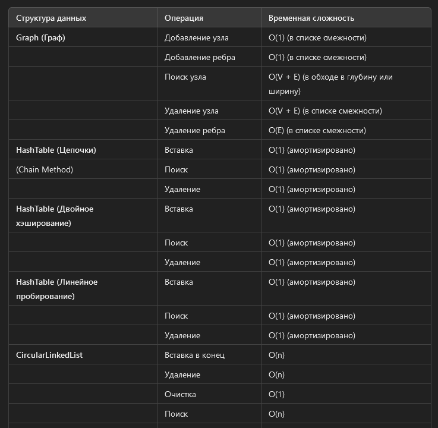
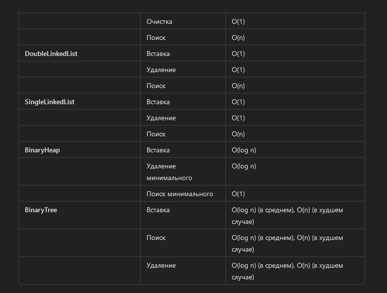
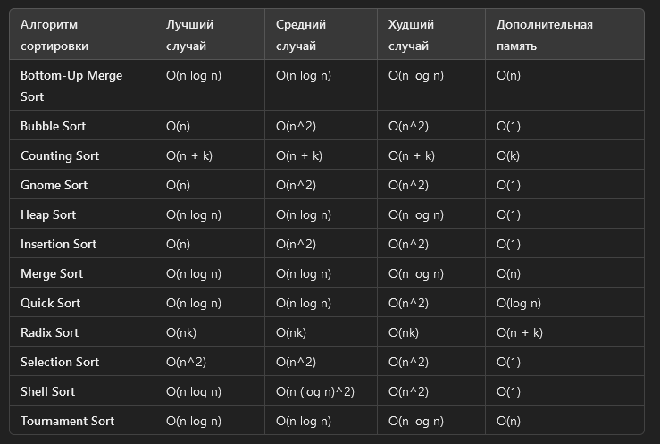

## Структуры данных

Примечания:

    Для графа временная сложность операций зависит от представления графа. Здесь указаны оценки для списка смежности.
    Для хеш-таблиц оценки даны для среднего случая, с учетом хорошей хэш-функции и равномерного распределения данных.
    Для бинарного дерева указаны средние и худшие случаи. В среднем случае дерево сбалансировано, а в худшем случае оно вырождается в связный список.
    Для кучи (BinaryHeap) временная сложность указана для операций на минимальной куче (min-heap).

## Сортировки

Определение худших и лучших случаев для различных алгоритмов сортировки важно для понимания их производительности. Давайте рассмотрим, в каких ситуациях происходят лучшие и худшие случаи для каждого алгоритма.
Bottom-Up Merge Sort

    Лучший случай: O(n log n)
        Происходит всегда, так как алгоритм всегда делит массив на части и затем сливает их, вне зависимости от исходного порядка элементов.
    Худший случай: O(n log n)
        Происходит всегда по той же причине.

Bubble Sort

    Лучший случай: O(n)
        Происходит, когда массив уже отсортирован. Алгоритм проходит через массив один раз, не делая перестановок.
    Худший случай: O(n^2)
        Происходит, когда массив отсортирован в обратном порядке. Алгоритм выполняет максимальное количество перестановок.

Counting Sort

    Лучший случай: O(n + k)
        Происходит, когда диапазон значений (k) относительно мал.
    Худший случай: O(n + k)
        Происходит, когда диапазон значений (k) относительно велик.

Gnome Sort

    Лучший случай: O(n)
        Происходит, когда массив уже отсортирован. Алгоритм проходит через массив без изменений.
    Худший случай: O(n^2)
        Происходит, когда массив отсортирован в обратном порядке. Алгоритм выполняет максимальное количество перестановок.

Heap Sort

    Лучший случай: O(n log n)
        Происходит всегда, поскольку алгоритм строит кучу и извлекает элементы вне зависимости от исходного порядка.
    Худший случай: O(n log n)
        Происходит всегда по той же причине.

Insertion Sort

    Лучший случай: O(n)
        Происходит, когда массив уже отсортирован. Алгоритм просто проходит через массив один раз.
    Худший случай: O(n^2)
        Происходит, когда массив отсортирован в обратном порядке. Алгоритм выполняет максимальное количество сдвигов элементов.

Merge Sort

    Лучший случай: O(n log n)
        Происходит всегда, так как алгоритм всегда делит массив на части и затем сливает их, вне зависимости от исходного порядка элементов.
    Худший случай: O(n log n)
        Происходит всегда по той же причине.

Quick Sort

    Лучший случай: O(n log n)
        Происходит, когда каждый раз выбранный опорный элемент делит массив на две равные части. Это можно достичь с хорошим выбором опорного элемента.
    Худший случай: O(n^2)
        Происходит, когда каждый раз выбранный опорный элемент делит массив на очень неравные части (например, если массив уже отсортирован и опорный элемент всегда выбирается как первый или последний элемент).

Radix Sort

    Лучший случай: O(nk)
        Происходит, когда диапазон значений и число цифр (k) относительно малы.
    Худший случай: O(nk)
        Происходит, когда диапазон значений и число цифр (k) относительно велики.

Selection Sort

    Лучший случай: O(n^2)
        Происходит всегда, поскольку алгоритм всегда ищет минимальный элемент для каждой позиции, независимо от исходного порядка.
    Худший случай: O(n^2)
        Происходит всегда по той же причине.

Shell Sort

    Лучший случай: O(n log n)
        Происходит для некоторых оптимальных промежутков (gaps) и когда массив частично отсортирован.
    Худший случай: O(n^2)
        Происходит для неоптимальных промежутков (gaps) и когда массив отсортирован в обратном порядке.

Tournament Sort

    Лучший случай: O(n log n)
        Происходит всегда, поскольку структура турнира всегда будет построена с фиксированными шагами.
    Худший случай: O(n log n)
        Происходит всегда по той же причине.

Эти случаи помогают лучше понять, как разные алгоритмы ведут себя на различных типах данных и в различных условиях.