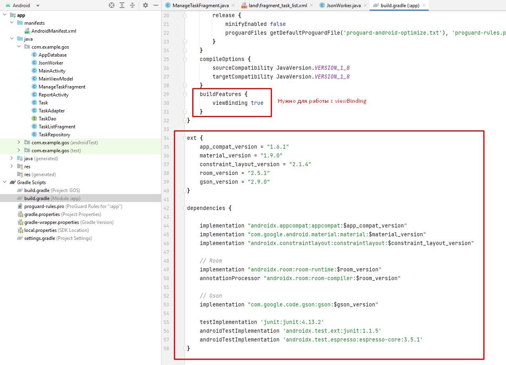

# ToDo List Application

1) Настройка зависимостей:
Обращаем внимание на файл buld.gradle на уровне модуля (не путать с уровнем проекта)

- Room - библиотека для работы с локальной БД SQLite (почитать можно [тут](https://developer.android.com/training/data-storage/room) или [тут](https://startandroid.ru/ru/courses/architecture-components/27-course/architecture-components/529-urok-5-room-osnovy.html))
- Gson - библиотека для упрощенной работы с форматом json

2) Экраны:

- MainActivity - контейнер фрагментов
    - ManageTaskFragment (upsert для сущности task)
    - TaskListFragment (выводит список фрагментов)
        - Содержит RecyclerViewAdapter (почитать можно [тут](https://developer.android.com/develop/ui/views/layout/recyclerview)). Более сложный вариант адаптера. Вместо него можно использовать другой, который найдете на StartAndroid, например, [этот](https://startandroid.ru/ru/uroki/vse-uroki-spiskom/107-urok-48-ispolzuem-simpleadapter.html)
        - Имеет 2 ориентации (портретную и горизонтальную)
- ReportActivity - используется для вывода отчета, на основе фильтрованной информации

3) Прочее

- Работа с json в классе JsonWorker. Код должен быть рабочим (лучше поработать с ним самостоятельно)
- Касаемо классов типа ViewBinding: удобная замена определения элементов через findViewById. На android developer уйма инфы про нее, но можно и по классике.

4) UPD: Я намудрил. Откажитесь от использования классов ViewModel и Repository, получая объект AppDatabase прямо в Activity/Fragment, создавая обычный Thread, и запрашивая результаты прямо в нем. В таком случае и никакие LiveData тоже будут не нужны!
